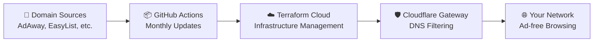

# Cloudflare Ad-Blocking Gateway

[](https://www.gnu.org/licenses/gpl-3.0)
[](https://www.terraform.io/)
[](https://www.cloudflare.com/)
[](https://developers.cloudflare.com/cloudflare-one/)
[](https://github.com/macharpe/cloudflare-terraformed-ad-gateway)
[](https://github.com/macharpe/cloudflare-terraformed-ad-gateway/actions/workflows/semgrep-security-scan.yml)

A Terraform-managed ad-blocking solution using Cloudflare Zero Trust Gateway that blocks DNS requests to advertising and tracking domains from multiple sources.

## Overview

This project implements DNS-based ad filtering by leveraging Cloudflare's Zero Trust Gateway policies. It automatically processes ad-blocking domain lists (like those used by Pi-hole) and creates Cloudflare policies that block DNS queries to these domains at the network level.

## Features

- **Multiple Domain Sources**: Supports AdAway, EasyList, StevenBlack, and more domain sources
- **Remote Source Fetching**: Automatically fetches and processes domain lists from HTTP sources
- **Local File Support**: Process local domain lists in hosts format
- **Large Scale Support**: Handles thousands of domains by automatically chunking lists into manageable sizes
- **Zero Trust Integration**: Uses Cloudflare's Zero Trust Gateway for enterprise-grade DNS filtering  
- **Format Compatibility**: Processes both `127.0.0.1` and `0.0.0.0` hosts file formats
- **Terraform Managed**: Infrastructure as code with state management via Terraform Cloud
- **Automated Updates**: GitHub Actions workflow for regular domain list updates

## Architecture


```mermaid
graph LR
    A[📡 Domain Sources<br/>AdAway, EasyList, etc.] --> B[📦 GitHub Actions<br/>Monthly Updates]
    B --> C[☁️ Terraform Cloud<br/>Infrastructure Management]
    C --> D[🛡️ Cloudflare Gateway<br/>DNS Filtering]
    D --> E[🌐 Your Network<br/>Ad-free Browsing]
```

### How it Works

1. **Domain Sources** → Fetch ad/tracker domains from multiple blocklists
2. **GitHub Actions** → Automatically update domain lists monthly  
3. **Terraform Cloud** → Deploy lists and policies to Cloudflare
4. **Cloudflare Gateway** → Block DNS requests to ad domains
5. **Your Network** → Enjoy ad-free browsing on all devices

## Usage

### Prerequisites

- Cloudflare account with Zero Trust enabled
- Terraform Cloud account
- Domain lists in AdAway/Pi-hole hosts format

### Setup

1. **Create Cloudflare API Token**:
   - Go to [Cloudflare API Tokens](https://dash.cloudflare.com/profile/api-tokens)
   - Click "Create Token" → "Custom Token"
   - **Required Permissions**:
     - `Account` - `Zero Trust` - `Edit`
     - `Account` - `Account Settings` - `Read`
   - **Account Resources**: Include your target account

2. **Configure Terraform Cloud**:
   - Create or use workspace: `terraform-dns-ad-gateway`
   - Set up **Terraform variables** (not environment variables):

   | Variable Name | Type | Sensitive | Description |
   |---------------|------|-----------|-------------|
   | `cloudflare_account_id` | Terraform variable | No | Your Cloudflare account ID |
   | `cloudflare_api_token` | Terraform variable | Yes | Your Cloudflare API token (created above) |

3. **Configure GitHub Actions Secrets** (for automated domain list updates):
   - `TF_API_TOKEN`: Terraform Cloud API token, used by Terraform-related checks
   - `AUTOMATION_PAT`: a fine-grained personal access token scoped to this repository (`Contents: write`, `Pull requests: write`), belonging to a repository admin — required so the monthly "Update Domain Lists" workflow can open pull requests that trigger the Semgrep security scan and auto-merge once it passes

4. **Domain Lists**:
   - Domain lists are automatically generated from configured sources
   - The combined list is stored in `lists/pihole_domain_list.txt`

5. **Deploy**:

   ```bash
   terraform init
   terraform plan
   terraform apply
   ```

### Configuration

#### Domain Sources

Configure domain sources in `variables.tf`:

```hcl
variable "domain_sources" {
  default = {
    adaway = {
      url         = "https://adaway.org/hosts.txt"
      enabled     = true
      description = "AdAway mobile ad blocking hosts"
      format      = "hosts"
    }
    easylist = {
      url         = "https://someonewhocares.org/hosts/zero/hosts"
      enabled     = true
      description = "Dan Pollock's EasyList hosts"
      format      = "hosts"
    }
  }
}
```

#### Policy Customization

The policy can be customized by modifying `main.tf`:

- **Policy Priority**: Adjust `precedence` value
- **Action**: Change from `block` to `allow` or other actions  
- **Filters**: Modify DNS filtering logic
- **Chunk Size**: Adjust domain list chunking (default: 1000)

### Updating Domain Lists

#### Automatic Updates (Recommended)

The "Update Domain Lists" GitHub Actions workflow runs monthly (or on demand) and is fully automated end to end:

1. Fetches and combines the configured domain sources
2. Opens a pull request with the updated `lists/pihole_domain_list.txt`
3. Waits for the pull request's Semgrep security scan to pass
4. Merges the pull request automatically, which triggers Terraform Cloud to apply the updated lists to Cloudflare

To trigger it manually: go to the Actions tab → "Update Domain Lists" → Run workflow → choose sources (or use the default: AdAway + EasyList).

This workflow requires a repository secret named `AUTOMATION_PAT` — a fine-grained personal access token (scoped to this repository, with `Contents: write` and `Pull requests: write`) belonging to a repository admin. It's used only to open the pull request, so that its Semgrep scan runs as a normal, properly-checked pull request rather than a disconnected manual trigger.

## Domain List Format

The system supports multiple hosts file formats:

### Supported Formats

**127.0.0.1 Format (AdAway):**

```text
# Comments start with #
127.0.0.1 ads.example.com
127.0.0.1 tracker.example.com
```

**0.0.0.0 Format (EasyList/someonewhocares.org):**

```text
# Comments start with #
0.0.0.0 ads.example.com
0.0.0.0 tracker.example.com
```

### Processing Rules

- Lines starting with `#` are ignored
- Empty lines are ignored  
- `localhost` entries are filtered out
- Only the domain portion is extracted and used
- Both `127.0.0.1` and `0.0.0.0` formats are supported

## Project Structure

```text
cloudflare-terraformed-ad-gateway/
├── README.md                     # This file
├── CLAUDE.md                     # Development documentation
├── DOMAIN_SOURCES.md            # Domain source information
├── LICENSE                      # GPL v3 License
├── lists/                       # Domain lists
│   └── pihole_domain_list.txt   # Combined domain list (127.0.0.1 format)
├── .github/
│   ├── dependabot.yml            # Automated dependency updates (github-actions, terraform)
│   └── workflows/                # GitHub Actions
│       ├── update-domain-lists.yml    # Automated domain list updates
│       └── semgrep-security-scan.yml  # Required Semgrep security scan
└── Terraform files:             # Infrastructure as Code
    ├── data-sources.tf          # HTTP data sources for remote lists
    ├── domain-lists.tf          # Zero Trust list resources
    ├── gateway-policy.tf        # Gateway policy configuration
    ├── locals.tf               # Local values and domain processing
    ├── outputs.tf              # Output values and monitoring
    ├── provider.tf             # Provider configuration
    └── variables.tf            # Input variables and validation
```

## Security

- **Semgrep Security Scan**: runs on every push, pull request, and weekly on a schedule, checking Terraform and CI configuration for security issues. It's a required status check — no pull request can merge without it passing.
- **Pinned GitHub Actions**: every third-party action used in the workflows is pinned to an immutable commit SHA (not a mutable version tag) to prevent supply-chain tampering.
- **Dependabot**: configured via `.github/dependabot.yml` for the `github-actions` and `terraform` ecosystems, with a 7-day update cooldown, so new action/provider versions are proposed automatically rather than left to go stale.
- **Secret scanning & push protection**: enabled on the repository, blocking commits that contain a detectable secret before they land.

## Monitoring

Monitor your ad-blocking effectiveness through:

- **Cloudflare Dashboard**: Zero Trust > Gateway > Analytics
- **DNS Logs**: View blocked/allowed queries
- **Policy Metrics**: Track policy effectiveness
- **Terraform Outputs**: View domain counts and source status

## Inspiration

This project was inspired by:

- [Serverless Ad Blocking with Cloudflare Gateway](https://blog.marcolancini.it/2022/blog-serverless-ad-blocking-with-cloudflare-gateway/)
- [YouTube: Cloudflare Zero Trust Tutorial](https://www.youtube.com/watch?v=FmYvrxYvBP0&t=900s)

## License

GPL v3 License - see the [LICENSE](LICENSE) file for details.
