# Cloudflare Ad-Blocking Gateway

[](https://opensource.org/licenses/MIT)
[](https://www.terraform.io/)
[](https://www.cloudflare.com/)
[](https://developers.cloudflare.com/cloudflare-one/)
[](https://github.com/macharpe/cloudflare-terraformed-ad-gateway)

A Terraform-managed ad-blocking solution using Cloudflare Zero Trust Gateway that blocks DNS requests to advertising and tracking domains from multiple sources.

## Overview

This project implements DNS-based ad filtering by leveraging Cloudflare's Zero Trust Gateway policies. It automatically processes ad-blocking domain lists (like those used by Pi-hole) and creates Cloudflare policies that block DNS queries to these domains at the network level.

## Features

- **Multiple Domain Sources**: Supports AdAway, EasyList, StevenBlack, and more domain sources
- **Remote Source Fetching**: Automatically fetches and processes domain lists from HTTP sources
- **Local File Support**: Process local domain lists in hosts format
- **Large Scale Support**: Handles thousands of domains by automatically chunking lists into manageable sizes
- **Zero Trust Integration**: Uses Cloudflare's Zero Trust Gateway for enterprise-grade DNS filtering  
- **Format Compatibility**: Processes both `127.0.0.1` and `0.0.0.0` hosts file formats
- **Terraform Managed**: Infrastructure as code with state management via Terraform Cloud
- **Automated Updates**: GitHub Actions workflow for regular domain list updates

## Architecture

```mermaid
graph TB
    %% Domain Sources
    AdAway["🌐 AdAway<br/>hosts.txt<br/>(~6,500 domains)"]
    EasyList["🌐 EasyList<br/>someonewhocares.org<br/>(~11,800 domains)"]
    StevenBlack["🌐 StevenBlack<br/>unified hosts<br/>(~100k+ domains)"]
    LocalFile["📁 Local File<br/>lists/pihole_domain_list.txt<br/>(manual domains)"]
    
    %% GitHub Components
    GitHubRepo["📦 GitHub Repository<br/>cloudflare-terraformed-ad-gateway"]
    GitHubActions["⚙️ GitHub Actions<br/>Update Domain Lists<br/>(Monthly/Manual)"]
    
    %% Terraform Components
    TerraformCloud["☁️ Terraform Cloud<br/>terraform-dns-ad-gateway<br/>workspace"]
    TerraformCode["📋 Terraform Code<br/>• HTTP Data Sources<br/>• Domain Processing<br/>• Zero Trust Lists<br/>• Gateway Policy"]
    
    %% Cloudflare Components
    CloudflareAPI["🔗 Cloudflare API<br/>Authentication:<br/>email + api_key"]
    ZeroTrustLists["📋 Zero Trust Lists<br/>ad-block-list-chunk-XX<br/>(max 1000 domains each)"]
    GatewayPolicy["🛡️ Gateway Policy<br/>DNS-Block: Ads Gateway Terraform<br/>(Blocks DNS queries)"]
    DNSFiltering["🌍 DNS Filtering<br/>Network-wide ad blocking<br/>for all devices"]
    
    %% Data Flow
    AdAway --> GitHubActions
    EasyList --> GitHubActions
    StevenBlack --> GitHubActions
    LocalFile --> TerraformCode
    
    GitHubActions --> |"Fetches & combines<br/>domain lists"| LocalFile
    GitHubActions --> |"Creates PR with<br/>updated domains"| GitHubRepo
    
    GitHubRepo --> |"VCS Integration<br/>Auto-triggers on PR merge"| TerraformCloud
    TerraformCode --> |"HTTP Data Sources<br/>fetch remote lists"| AdAway
    TerraformCode --> |"HTTP Data Sources<br/>fetch remote lists"| EasyList
    TerraformCode --> |"HTTP Data Sources<br/>fetch remote lists"| StevenBlack
    
    TerraformCloud --> |"Processes domains<br/>& manages infrastructure"| TerraformCode
    TerraformCode --> |"API calls to create<br/>lists and policies"| CloudflareAPI
    CloudflareAPI --> |"Creates chunked<br/>domain lists"| ZeroTrustLists
    CloudflareAPI --> |"Creates blocking<br/>policy"| GatewayPolicy
    
    ZeroTrustLists --> |"Referenced by<br/>gateway policy"| GatewayPolicy
    GatewayPolicy --> |"Blocks DNS queries<br/>to listed domains"| DNSFiltering
    
    %% Styling
    classDef source fill:#e1f5fe,stroke:#01579b,stroke-width:2px
    classDef github fill:#f3e5f5,stroke:#4a148c,stroke-width:2px
    classDef terraform fill:#fff3e0,stroke:#e65100,stroke-width:2px
    classDef cloudflare fill:#fff8e1,stroke:#f57f17,stroke-width:2px
    
    class AdAway,EasyList,StevenBlack,LocalFile source
    class GitHubRepo,GitHubActions github
    class TerraformCloud,TerraformCode terraform
    class CloudflareAPI,ZeroTrustLists,GatewayPolicy,DNSFiltering cloudflare
```



### Component Overview

- **Domain Sources**: Multiple remote and local domain sources (AdAway, EasyList, etc.)
- **Domain Processing**: Automated fetching and processing of hosts files from HTTP sources
- **Zero Trust Lists**: Creates multiple Cloudflare lists (chunked to 1000 domains each)
- **Gateway Policy**: Implements a blocking policy that matches against all domain lists
- **GitHub Actions**: Automated workflow for updating domain lists
- **Terraform Cloud**: Manages state and execution remotely

## How It Works

```mermaid
sequenceDiagram
    participant User as 👤 User
    participant GHA as ⚙️ GitHub Actions
    participant Repo as 📦 GitHub Repo
    participant TC as ☁️ Terraform Cloud
    participant TF as 📋 Terraform Code
    participant CF as 🔗 Cloudflare API
    participant DNS as 🌍 DNS Filtering

    Note over User,DNS: Monthly Automated Update Flow
    
    GHA->>+AdAway: Fetch hosts.txt (~6,500 domains)
    GHA->>+EasyList: Fetch hosts (~11,800 domains)
    GHA->>GHA: Process & combine domains
    GHA->>Repo: Create PR with updated domain list
    
    Note over User,DNS: Manual Trigger or PR Merge
    
    User->>Repo: Merge PR (or manual trigger)
    Repo->>TC: VCS integration triggers plan
    TC->>+TF: Execute Terraform plan/apply
    TF->>+AdAway: HTTP data source fetch
    TF->>+EasyList: HTTP data source fetch  
    TF->>TF: Process domains (both formats)
    TF->>TF: Chunk domains (1000 per list)
    TF->>+CF: Create/update Zero Trust lists
    TF->>+CF: Create/update Gateway policy
    CF->>DNS: Enable DNS blocking
    DNS-->>User: Network-wide ad blocking active
```



### Step-by-Step Process

1. **Source Configuration**: Configure domain sources in `variables.tf` (remote HTTP sources and local files)
2. **Remote Fetching**: HTTP data sources automatically fetch domain lists from configured URLs
3. **Domain Processing**: Processes both local (`lists/pihole_domain_list.txt`) and remote sources
4. **Format Support**: Handles both `127.0.0.1` and `0.0.0.0` hosts file formats
5. **List Chunking**: Automatically splits domains into groups of 1000 (Cloudflare's limit)
6. **Zero Trust Lists**: Creates multiple `cloudflare_zero_trust_list` resources
7. **Gateway Policy**: Deploys a policy that blocks DNS queries matching any listed domain
8. **DNS Filtering**: Cloudflare Gateway blocks requests to advertising domains network-wide

## Usage

### Prerequisites

- Cloudflare account with Zero Trust enabled
- Terraform Cloud account
- Domain lists in AdAway/Pi-hole hosts format

### Setup

1. **Configure Terraform Cloud**:
   - Create or use workspace: `terraform-dns-ad-gateway`
   - Set up **Terraform variables** (not environment variables):
   
   | Variable Name | Type | Sensitive | Description |
   |---------------|------|-----------|-------------|
   | `cloudflare_account_id` | Terraform variable | No | Your Cloudflare account ID |
   | `cloudflare_email` | Terraform variable | Yes | Your Cloudflare email address |
   | `cloudflare_api_key` | Terraform variable | Yes | Your Cloudflare API key |

2. **Update Domain Lists**:
   - Place your ad-blocking domains in `lists/pihole_domain_list.txt`
   - Format: `127.0.0.1 domain.com` (one per line)

3. **Deploy**:
   ```bash
   terraform init
   terraform plan
   terraform apply
   ```

### Configuration

#### Domain Sources

Configure domain sources in `variables.tf`:

```hcl
variable "domain_sources" {
  default = {
    adaway = {
      url         = "https://adaway.org/hosts.txt"
      enabled     = true
      description = "AdAway mobile ad blocking hosts"
      format      = "hosts"
    }
    easylist = {
      url         = "https://someonewhocares.org/hosts/zero/hosts"
      enabled     = true
      description = "Dan Pollock's EasyList hosts"
      format      = "hosts"
    }
  }
}
```

#### Policy Customization

The policy can be customized by modifying `main.tf`:

- **Policy Priority**: Adjust `precedence` value
- **Action**: Change from `block` to `allow` or other actions  
- **Filters**: Modify DNS filtering logic
- **Chunk Size**: Adjust domain list chunking (default: 1000)

### Updating Domain Lists

#### Automatic Updates (Recommended)

Use the GitHub Actions workflow:
1. Go to Actions tab in your repository
2. Run "Update Domain Lists" workflow
3. Choose sources to update (or use default: AdAway + EasyList)
4. Workflow creates a PR with updated domain lists

#### Manual Updates

To manually update blocked domains:

1. Update `lists/pihole_domain_list.txt` with new domains
2. Run `terraform apply` to update the lists and policy
3. Changes are applied automatically to your Gateway policy

## Domain List Format

The system supports multiple hosts file formats:

### Supported Formats

**127.0.0.1 Format (AdAway):**
```
# Comments start with #
127.0.0.1 ads.example.com
127.0.0.1 tracker.example.com
```

**0.0.0.0 Format (EasyList/someonewhocares.org):**
```
# Comments start with #
0.0.0.0 ads.example.com
0.0.0.0 tracker.example.com
```

### Processing Rules

- Lines starting with `#` are ignored
- Empty lines are ignored  
- `localhost` entries are filtered out
- Only the domain portion is extracted and used
- Both `127.0.0.1` and `0.0.0.0` formats are supported

## Project Structure

```
cloudflare-terraformed-ad-gateway/
├── README.md                     # This file
├── CLAUDE.md                     # Development documentation
├── DOMAIN_SOURCES.md            # Domain source information
├── LICENSE                      # MIT License
├── lists/                       # Domain lists
│   └── pihole_domain_list.txt   # Combined domain list (127.0.0.1 format)
├── .github/workflows/           # GitHub Actions
│   └── update-domain-lists.yml  # Automated domain list updates
└── Terraform files:             # Infrastructure as Code
    ├── data-sources.tf          # HTTP data sources for remote lists
    ├── domain-lists.tf          # Zero Trust list resources
    ├── gateway-policy.tf        # Gateway policy configuration
    ├── locals.tf               # Local values and domain processing
    ├── outputs.tf              # Output values and monitoring
    ├── provider.tf             # Provider configuration
    └── variables.tf            # Input variables and validation
```

## Monitoring

Monitor your ad-blocking effectiveness through:

- **Cloudflare Dashboard**: Zero Trust > Gateway > Analytics
- **DNS Logs**: View blocked/allowed queries
- **Policy Metrics**: Track policy effectiveness
- **Terraform Outputs**: View domain counts and source status

## Inspiration

This project was inspired by:
- [Serverless Ad Blocking with Cloudflare Gateway](https://blog.marcolancini.it/2022/blog-serverless-ad-blocking-with-cloudflare-gateway/)
- [YouTube: Cloudflare Zero Trust Tutorial](https://www.youtube.com/watch?v=FmYvrxYvBP0&t=900s)

## License

MIT License - feel free to use and modify for your own ad-blocking needs.
