# Cloudflare Ad-Blocking Gateway

[](https://opensource.org/licenses/MIT)
[](https://www.terraform.io/)
[](https://www.cloudflare.com/)
[](https://developers.cloudflare.com/cloudflare-one/)
[](https://github.com/macharpe/cloudflare-terraformed-ad-gateway)

A Terraform-managed ad-blocking solution using Cloudflare Zero Trust Gateway that blocks DNS requests to advertising and tracking domains from multiple sources.

## Overview

This project implements DNS-based ad filtering by leveraging Cloudflare's Zero Trust Gateway policies. It automatically processes ad-blocking domain lists (like those used by Pi-hole) and creates Cloudflare policies that block DNS queries to these domains at the network level.

## Features

- **Multiple Domain Sources**: Supports AdAway, EasyList, StevenBlack, and more domain sources
- **Remote Source Fetching**: Automatically fetches and processes domain lists from HTTP sources
- **Local File Support**: Process local domain lists in hosts format
- **Large Scale Support**: Handles thousands of domains by automatically chunking lists into manageable sizes
- **Zero Trust Integration**: Uses Cloudflare's Zero Trust Gateway for enterprise-grade DNS filtering  
- **Format Compatibility**: Processes both `127.0.0.1` and `0.0.0.0` hosts file formats
- **Terraform Managed**: Infrastructure as code with state management via Terraform Cloud
- **Automated Updates**: GitHub Actions workflow for regular domain list updates

## Architecture

```mermaid
graph LR
    A[📡 Domain Sources<br/>AdAway, EasyList, etc.] --> B[📦 GitHub Actions<br/>Monthly Updates]
    B --> C[☁️ Terraform Cloud<br/>Infrastructure Management]
    C --> D[🛡️ Cloudflare Gateway<br/>DNS Filtering]
    D --> E[🌐 Your Network<br/>Ad-free Browsing]
```



### How it Works

1. **Domain Sources** → Fetch ad/tracker domains from multiple blocklists
2. **GitHub Actions** → Automatically update domain lists monthly  
3. **Terraform Cloud** → Deploy lists and policies to Cloudflare
4. **Cloudflare Gateway** → Block DNS requests to ad domains
5. **Your Network** → Enjoy ad-free browsing on all devices

## Usage

### Prerequisites

- Cloudflare account with Zero Trust enabled
- Terraform Cloud account
- Domain lists in AdAway/Pi-hole hosts format

### Setup

1. **Create Cloudflare API Token**:
   - Go to [Cloudflare API Tokens](https://dash.cloudflare.com/profile/api-tokens)
   - Click "Create Token" → "Custom Token"
   - **Required Permissions**:
     - `Account` - `Zero Trust` - `Edit`
     - `Account` - `Account Settings` - `Read`
   - **Account Resources**: Include your target account

2. **Configure Terraform Cloud**:
   - Create or use workspace: `terraform-dns-ad-gateway`
   - Set up **Terraform variables** (not environment variables):

   | Variable Name | Type | Sensitive | Description |
   |---------------|------|-----------|-------------|
   | `cloudflare_account_id` | Terraform variable | No | Your Cloudflare account ID |
   | `cloudflare_api_token` | Terraform variable | Yes | Your Cloudflare API token (created above) |

3. **Domain Lists**:
   - Domain lists are automatically generated from configured sources
   - The combined list is stored in `lists/pihole_domain_list.txt`

4. **Deploy**:

   ```bash
   terraform init
   terraform plan
   terraform apply
   ```

### Configuration

#### Domain Sources

Configure domain sources in `variables.tf`:

```hcl
variable "domain_sources" {
  default = {
    adaway = {
      url         = "https://adaway.org/hosts.txt"
      enabled     = true
      description = "AdAway mobile ad blocking hosts"
      format      = "hosts"
    }
    easylist = {
      url         = "https://someonewhocares.org/hosts/zero/hosts"
      enabled     = true
      description = "Dan Pollock's EasyList hosts"
      format      = "hosts"
    }
  }
}
```

#### Policy Customization

The policy can be customized by modifying `main.tf`:

- **Policy Priority**: Adjust `precedence` value
- **Action**: Change from `block` to `allow` or other actions  
- **Filters**: Modify DNS filtering logic
- **Chunk Size**: Adjust domain list chunking (default: 1000)

### Updating Domain Lists

#### Automatic Updates (Recommended)

Use the GitHub Actions workflow:
1. Go to Actions tab in your repository
2. Run "Update Domain Lists" workflow
3. Choose sources to update (or use default: AdAway + EasyList)
4. Workflow creates a PR with updated domain lists

## Domain List Format

The system supports multiple hosts file formats:

### Supported Formats

**127.0.0.1 Format (AdAway):**

```text
# Comments start with #
127.0.0.1 ads.example.com
127.0.0.1 tracker.example.com
```

**0.0.0.0 Format (EasyList/someonewhocares.org):**

```text
# Comments start with #
0.0.0.0 ads.example.com
0.0.0.0 tracker.example.com
```

### Processing Rules

- Lines starting with `#` are ignored
- Empty lines are ignored  
- `localhost` entries are filtered out
- Only the domain portion is extracted and used
- Both `127.0.0.1` and `0.0.0.0` formats are supported

## Project Structure

```text
cloudflare-terraformed-ad-gateway/
├── README.md                     # This file
├── CLAUDE.md                     # Development documentation
├── DOMAIN_SOURCES.md            # Domain source information
├── LICENSE                      # MIT License
├── lists/                       # Domain lists
│   └── pihole_domain_list.txt   # Combined domain list (127.0.0.1 format)
├── .github/workflows/           # GitHub Actions
│   └── update-domain-lists.yml  # Automated domain list updates
└── Terraform files:             # Infrastructure as Code
    ├── data-sources.tf          # HTTP data sources for remote lists
    ├── domain-lists.tf          # Zero Trust list resources
    ├── gateway-policy.tf        # Gateway policy configuration
    ├── locals.tf               # Local values and domain processing
    ├── outputs.tf              # Output values and monitoring
    ├── provider.tf             # Provider configuration
    └── variables.tf            # Input variables and validation
```

## Monitoring

Monitor your ad-blocking effectiveness through:

- **Cloudflare Dashboard**: Zero Trust > Gateway > Analytics
- **DNS Logs**: View blocked/allowed queries
- **Policy Metrics**: Track policy effectiveness
- **Terraform Outputs**: View domain counts and source status

## Inspiration

This project was inspired by:

- [Serverless Ad Blocking with Cloudflare Gateway](https://blog.marcolancini.it/2022/blog-serverless-ad-blocking-with-cloudflare-gateway/)
- [YouTube: Cloudflare Zero Trust Tutorial](https://www.youtube.com/watch?v=FmYvrxYvBP0&t=900s)

## License

MIT License - feel free to use and modify for your own ad-blocking needs.
